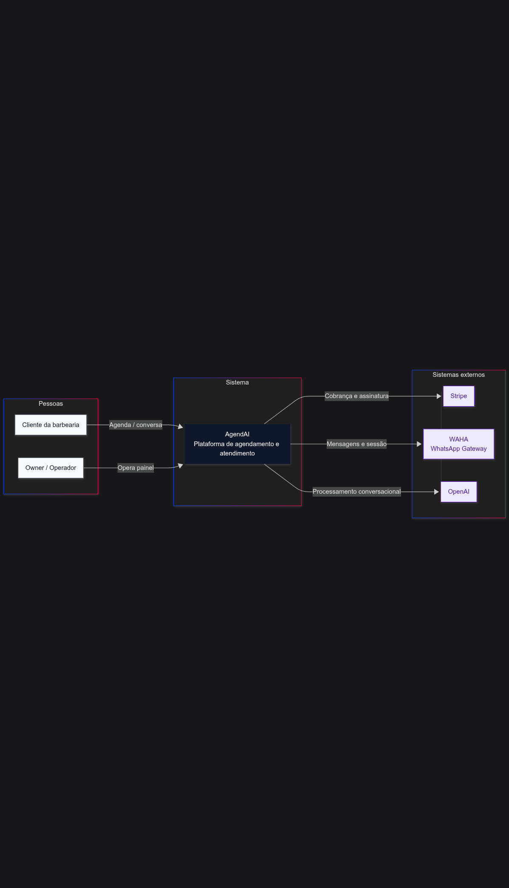
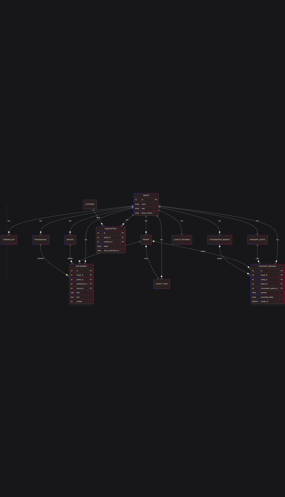

# AgendAI System Design

## Navegação rápida
- [Arquitetura](./architecture.md)
- [Infraestrutura e Deploy](./infra.md)
- [Estratégia Multi-Tenant](./tenancy-strategy.md)
- [Database Design](./database-design.md)
- [Fluxo de Pagamentos](./payments-flow.md)

## Diagramas
### C4 Context

### C4 Containers

### ERD

## Problem Statement
**Decisão tomada:** construir um SaaS de agendamento para barbearias com operação enxuta, orientado a WhatsApp, e com automação suficiente para reduzir dependência de atendimento manual.

A dor central é operacional: pequenos negócios perdem receita por agenda desorganizada, confirmação manual, lembretes esquecidos e baixa previsibilidade da demanda. Ao mesmo tempo, precisam de uma solução de adoção rápida, sem time técnico interno e com custo previsível.

O AgendAI resolve esse problema com:
- agenda multi-tenant para múltiplas barbearias;
- interface pública para autoagendamento;
- integração com WhatsApp para comunicação e automação;
- cobrança recorrente com Stripe para viabilizar o modelo SaaS.

A direção de engenharia foi orientada por uma restrição realista: **produto de produção evoluído por dev solo**, com foco em velocidade de entrega, simplicidade operacional e confiabilidade incremental.

## System Requirements
**Decisão tomada:** priorizar um conjunto de requisitos que maximize valor de negócio por unidade de complexidade.

### Requisitos funcionais
- Cadastro e gestão de tenant (barbearia), profissionais, serviços e horários de trabalho.
- Agendamento público por tenant via URL dedicada (`tenant_slug`).
- Agenda interna com controle de conflitos de horário e duração.
- Cadastro e histórico de clientes/pacientes por tenant.
- Assinatura com trial, checkout e gestão de status via Stripe.
- Integração WhatsApp para:
  - recebimento de mensagens;
  - envio de respostas;
  - confirmações e lembretes.
- Assistente conversacional com ferramentas para:
  - consultar horários;
  - agendar;
  - reagendar;
  - cancelar;
  - criar cliente.

### Requisitos não funcionais
- Isolamento lógico de dados entre tenants.
- Baixa fricção de operação e deploy.
- Processamento assíncrono para fluxos sujeitos a latência externa (WhatsApp, IA, notificações).
- Convergência de estado financeiro mesmo com falhas transitórias (webhooks e reconciliação).
- Segurança web base (HTTPS, headers de segurança, controle CSRF, segregação de segredos por ambiente).
- Evolução incremental sem necessidade de replatforming imediato.

## Arquitetura escolhida
**Decisão tomada:** adotar um **monólito modular Django** com workers assíncronos e integrações externas especializadas.

Essa arquitetura foi a escolha correta para o estágio do produto porque:
- reduz custo cognitivo e operacional comparado a microserviços;
- mantém fronteiras de domínio claras por app (`core`, `scheduling`, `billing`, `whatsapp`, `assistant`, `agendamento`);
- permite entrega rápida com rollback simples e depuração centralizada.

Componentes principais:
- **Web app**: Django + ASGI (Uvicorn/Gunicorn), middleware de tenant e assinatura.
- **Banco**: PostgreSQL transacional.
- **Fila e agenda assíncrona**: Redis + Celery (worker + beat).
- **Mensageria WhatsApp**: WAHA como gateway de sessão/eventos.
- **Pagamentos**: Stripe (checkout + webhooks).
- **IA**: OpenAI para orquestração conversacional com tool-calling.

Risco aceito:
- maior acoplamento interno de módulos no mesmo deploy.

Mitigação:
- separação por domínios, modelos e rotas por app;
- processamento assíncrono para fluxos de integração;
- desenho orientado a extração futura de componentes críticos, se necessário.

## Estratégia multi-tenant
**Decisão tomada:** tenancy por linha (`tenant_id`) com enforcement em múltiplas camadas, em vez de banco por tenant.

Por que foi correta:
- custo operacional drasticamente menor;
- esquema único simplifica migrações e observabilidade;
- suficiente para o estágio de crescimento e perfil de clientes.

Mecanismos de isolamento usados:
- `TenantMiddleware` resolve o tenant autenticado no request.
- `set_current_tenant` em contexto thread-local para escopo de execução.
- `require_tenant` em views protegidas.
- filtros explícitos por tenant nos querysets.
- `TenantManager` para modelos com enforcement automático quando aplicável.

Risco aceito:
- dependência de disciplina de engenharia para sempre aplicar escopo tenant.

Mitigação:
- guardrails de middleware/decorator/manager;
- constraints por tenant (ex.: unicidade de telefone por tenant);
- revisão contínua de código em pontos críticos de leitura/gravação.

## Modelagem de dados
**Decisão tomada:** modelar entidades centrais orientadas a operação diária de barbearia e recorrência de receita SaaS.

Núcleo de domínio:
- `Tenant`, `WorkingDay`, `Professional`.
- `Patient`, `Service`, `Appointment`, `RecurringRule`.
- `LoyaltyProgram`, `LoyaltyCard`.

Faturamento:
- `Customer` (mapeamento local do customer Stripe por tenant/usuário).
- `Subscription` (estado financeiro local e janela de ciclo).

WhatsApp e IA:
- `WhatsAppConfig` (sessão por tenant).
- `WhatsAppMessage` (trilha inbound/outbound, status de processamento, retry).
- `ConversationSession` (continuidade contextual por tenant + telefone).

Risco aceito:
- aumento gradual de cardinalidade em mensagens e histórico conversacional.

Mitigação:
- processamento assíncrono;
- modelo explícito de status/retry;
- possibilidade de arquivamento/particionamento futuro por data.

## Fluxo de pagamentos (Stripe + Webhooks)
**Decisão tomada:** usar Stripe Checkout para aquisição e webhooks como fonte de atualização de estados de assinatura.

Fluxo principal:
1. Tenant inicia trial no onboarding.
2. Em upgrade, sistema cria sessão de checkout Stripe.
3. Evento `checkout.session.completed` vincula `stripe_subscription_id` local.
4. Eventos de fatura/assinatura atualizam estado (`active`, `past_due`, `unpaid`, `canceled`).

Por que foi correta:
- delega PCI e complexidade de cobrança ao Stripe;
- converte pagamentos em eventos rastreáveis e auditáveis;
- desacopla confirmação de pagamento da navegação do usuário.

Risco aceito:
- assincronismo entre ação do usuário e confirmação final do estado.

Mitigação:
- endpoint de webhook idempotente;
- reconciliação manual/assistida via consulta de dados da assinatura;
- middleware de assinatura para enforcement de acesso e proteção operacional.

## Integração WhatsApp
**Decisão tomada:** integrar via WAHA e tratar mensagens com pipeline assíncrono para robustez operacional.

Fluxo resumido:
1. WAHA publica evento para webhook.
2. Sistema resolve tenant/sessão, valida assinatura ativa e persiste inbound.
3. Mensagem é enfileirada (`process_incoming_message`).
4. Assistente processa contexto e executa ferramentas de agenda.
5. Resposta outbound é persistida e enviada pelo WAHA.

Por que foi correta:
- desacopla ingestão de mensagem da execução de IA/negócio;
- reduz risco de timeout em webhooks;
- mantém rastreabilidade completa de mensagem.

Risco aceito:
- dependência de serviço externo de mensageria para disponibilidade de canal.

Mitigação:
- gestão explícita de sessão WAHA;
- retries/status de processamento;
- controles de deduplicação e filtros de payload.

## Infraestrutura e deploy
**Decisão tomada:** operar com stack containerizada simples (Docker Compose) com separação clara de responsabilidades.

Topologia:
- `web` (Django ASGI)
- `db` (PostgreSQL)
- `redis`
- `celery` (worker)
- `celery_beat` (scheduler)
- `waha`
- `nginx`

Produção:
- Gunicorn + Uvicorn worker no app web.
- TLS e proxy reverso no Nginx.
- portas internas não expostas para banco/redis em perfil de produção.

Por que foi correta:
- excelente relação custo-benefício para equipe enxuta;
- baixa fricção de manutenção;
- caminho objetivo de evolução para orquestração mais avançada quando necessário.

Risco aceito:
- limitação de elasticidade horizontal comparado a plataformas totalmente gerenciadas.

Mitigação:
- arquitetura modular e stateless no app web;
- externalização de variáveis de ambiente e segredos;
- possibilidade de migração gradual por componente (DB, queue, runtime).

## Trade-offs e decisões
**Decisão tomada:** privilegiar velocidade de entrega sustentável e simplicidade operacional, sem comprometer fundamentos de confiabilidade.

Trade-offs assumidos conscientemente:
- Monólito modular em vez de microserviços.
- Tenancy por linha em vez de banco/schema por tenant.
- Infra via Compose em vez de orquestração completa desde o início.
- Integrações externas (Stripe/WAHA/OpenAI) em vez de soluções internas.

Defesa técnica dessas decisões:
- reduz tempo até valor para cliente real;
- reduz superfície operacional para dev solo;
- preserva opcionalidade arquitetural para evolução futura;
- mantém foco em problemas de negócio, não em complexidade acidental.

## Desafios técnicos reais resolvidos
**Decisão tomada:** resolver primeiro os problemas que mais afetam confiabilidade operacional e receita.

Exemplos concretos:
- **Convergência de assinatura:** atualização de estado por webhooks e reconciliação de dados Stripe.
- **Enforcement de acesso por assinatura:** bloqueio/redirect para estados não elegíveis.
- **Operação WhatsApp em produção:** gestão de sessão, status e webhook por tenant.
- **Processamento assíncrono resiliente:** pipeline com status de processamento, retries e trilha de mensagem.
- **Isolamento multi-tenant pragmático:** resolução de tenant por request + guardrails de acesso.
- **Agenda pública com controle de disponibilidade:** geração de slots considerando expediente e sobreposição.

Resultado de engenharia:
- sistema com arquitetura coerente para estágio atual do produto;
- decisões defendáveis tecnicamente no contexto de equipe enxuta;
- base sólida para crescimento com refactors incrementais, sem reescrita total.
