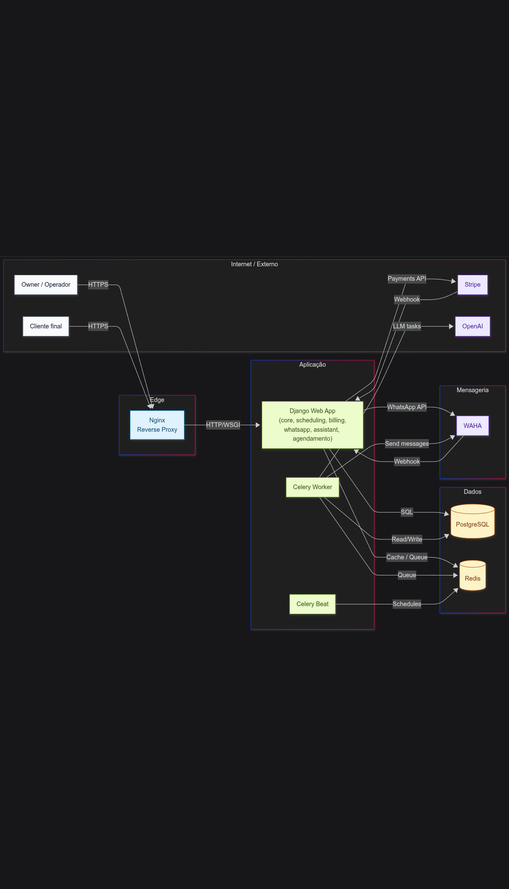

# Infraestrutura e Deploy

## Diagrama de Containers

## 1. Decisão de infraestrutura
**Decisão tomada:** stack containerizada com Docker Compose, separando runtime web, dados, mensageria e workers.

Objetivo:
- manter operação de produção simples e previsível;
- reduzir overhead de plataforma em contexto de time enxuto;
- preservar caminho de evolução sem lock-in de arquitetura complexa precoce.

## 2. Componentes
- `web`: aplicação Django (ASGI), endpoint principal.
- `nginx`: reverse proxy, assets estáticos e TLS em produção.
- `db`: PostgreSQL.
- `redis`: broker e backend de resultado para Celery.
- `celery`: worker de tarefas assíncronas.
- `celery_beat`: agendamento periódico.
- `waha`: gateway de sessão e eventos do WhatsApp.

## 3. Perfis de execução
### Desenvolvimento
- `uvicorn --reload` no serviço web.
- portas de banco/redis expostas para conveniência local.

### Produção
- Gunicorn com worker Uvicorn para ASGI.
- Nginx com TLS.
- banco e redis sem exposição pública direta.

## 4. Segurança operacional (sem segredos)
- segredos via variáveis de ambiente.
- redirecionamento para HTTPS e cookies seguros em produção.
- origens confiáveis de CSRF explicitamente controladas.
- headers de segurança habilitados no ambiente não-debug.

## 5. Disponibilidade e resiliência
- tarefas assíncronas absorvem picos e latência externa.
- separação de processos evita que processamento de integração degrade UX web.
- periodic tasks suportam autocorreção de sessão e rotinas operacionais.

## 6. Trade-offs de infraestrutura
Risco aceito:
- menor elasticidade automática comparado a plataformas totalmente gerenciadas.

Mitigação:
- baixo custo e simplicidade no estágio atual;
- componentes desacoplados o suficiente para migração gradual futura (DB gerenciado, fila gerenciada, orquestrador).

## 7. Caminho de evolução
- observabilidade com correlação por tenant e request/event id;
- hardening de deploy com pipeline CI/CD e checks automatizados;
- estratégia de backup/restore e testes de desastre formalizados;
- possível migração progressiva para orquestração quando carga justificar.
