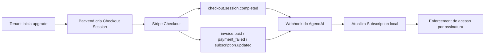

# Fluxo de Pagamentos (Stripe + Webhooks)

## Diagrama do Fluxo de Billing

## 1. Decisão de billing
**Decisão tomada:** Stripe como plataforma de cobrança e webhooks como mecanismo principal de convergência de estado financeiro.

Razão técnica:
- reduz escopo de compliance e risco PCI;
- oferece eventos confiáveis para lifecycle de assinatura;
- simplifica expansão de cobrança recorrente.

## 2. Jornada de assinatura
1. Tenant é criado com trial inicial.
2. Usuário acessa upgrade e inicia checkout.
3. Sistema cria `Checkout Session` Stripe com metadata de tenant/usuário.
4. `stripe_session_id` fica persistido localmente.
5. Stripe emite eventos para webhook.
6. Sistema atualiza `Subscription` local conforme evento.

## 3. Eventos processados
- `checkout.session.completed`: vincula subscription real e ativa assinatura.
- `invoice.paid`: marca assinatura ativa.
- `invoice.payment_failed`: marca `past_due` e dispara notificação.
- `invoice.finalization_failed`: marca `unpaid`.
- `customer.subscription.updated`: sincroniza status.
- `customer.subscription.deleted`: marca cancelada.

## 4. Estados internos
Estados usados em `Subscription`:
- `trialing`
- `active`
- `incomplete`
- `past_due`
- `unpaid`
- `canceled`
- `incomplete_expired`

## 5. Guardrails operacionais
- Middleware de assinatura restringe acesso em estados não elegíveis.
- Em cenários de inadimplência crítica, integração WhatsApp pode ser interrompida para evitar custo operacional sem receita.
- Endpoint de consulta/reconciliação ajuda em cenários de inconsistência transitória.

## 6. Riscos e mitigação
Risco aceito:
- assincronismo natural entre ação do usuário e atualização final do estado local.

Mitigação:
- webhooks como fonte de verdade operacional;
- persistência de identificadores Stripe locais;
- reconciliação sob demanda e tratamento de falhas de processamento.

## 7. Decisão de engenharia defendida
A arquitetura é orientada a eventos por design: pagamento não depende de callback de frontend para consistência de estado. Essa escolha aumenta robustez financeira e reduz fragilidade do fluxo comercial.
